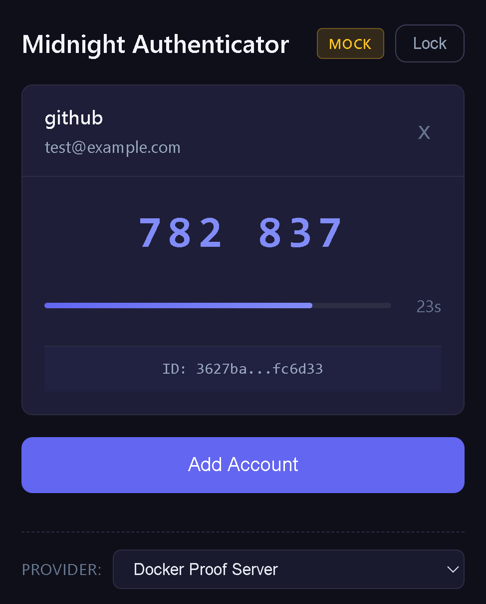
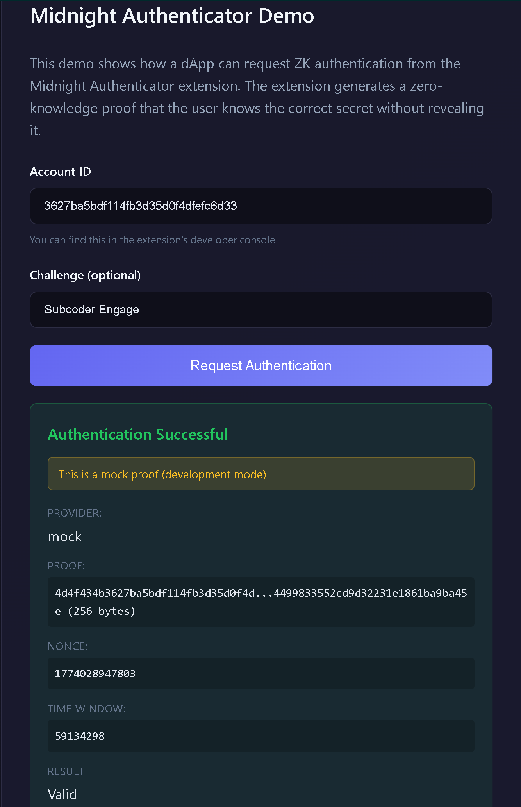

# Midnight Authenticator

> Built on the [Midnight Network](https://midnight.network)

**Zero-knowledge TOTP authenticator for the Midnight blockchain.**

*Prove you have the right code without showing it.*

Midnight Authenticator enables users to prove they possess a valid authentication code without revealing the underlying secret or the code itself. Unlike traditional 2FA where codes are transmitted in plaintext, this authenticator replaces codes with zero-knowledge proofs - privacy-preserving 2FA that doesn't leak secrets to verifiers.

**Contract deployed on Preprod:** [`02b325...1d66`](https://preprod.midnightexplorer.io/contract/02b3255950655d5c3f2695692e8135c1c4119240c64a6abfe92bdafbc1751d66)

## Screenshots

| Extension | Demo dApp |
|-----------|-----------|
|  |  |

## Important: ZK-Native Protocol

This authenticator uses Midnight's `persistentHash` for code generation, making it a **ZK-native protocol**. It is **NOT RFC 6238 (TOTP) compatible**.

| Aspect | Standard TOTP | Midnight Authenticator |
|--------|---------------|------------------------|
| Hash function | HMAC-SHA1 | persistentHash (ZK-friendly) |
| Interoperability | Works with Google Auth, etc. | Standalone ZK system |
| Privacy | Codes transmitted in plaintext | Codes never transmitted (ZK proof instead) |
| Verification | Server compares codes | Server verifies ZK proof |

Codes displayed in this app will **NOT match** standard authenticators like Google Authenticator.

## Status

**Phase 4: ZK Integration** - Mainnet Ready

| Component | Status | Notes |
|-----------|--------|-------|
| Compact Contract | ✅ Deployed | `totp-verifier.compact` on preprod |
| TypeScript Bindings | ✅ Generated | Full type-safe API |
| Chrome Extension | ✅ MVP Complete | Encrypted vault, ZK code generation |
| Proof Provider | ✅ Architecture Ready | Lace wallet integration for mainnet |
| Security Reviews | ✅ 9 Reviews | All issues addressed |
| Test Coverage | ✅ 129 Tests | Vault, backup, accounts, crypto |

### Proof Generation

The extension supports multiple proof providers with automatic fallback:

| Provider | Environment | Status |
|----------|-------------|--------|
| **Lace Wallet** | Mainnet | Ready (activates at mainnet) |
| Docker Proof Server | Development | Available locally |
| Mock Proofs | Development | For testing only |

At mainnet, users with Lace wallet will automatically use Midnight's hosted proof servers - no Docker required.

## Features

- Zero-knowledge authentication using Midnight's ZK proof system
- ZK-native code generation (`persistentHash`)
- Encrypted local vault (Argon2id + AES-256-GCM)
- Encrypted backup/restore with password protection
- Chrome extension (Manifest V3)
- Real-time countdown timer (30-second windows)
- Click-to-copy codes
- Auto-lock security timer (5 minutes)
- Dark theme UI

## How It Works

### Traditional TOTP Problem
- Service stores shared secrets (can be leaked)
- Codes transmitted in plaintext (can be intercepted)
- Service knows exact authentication times

### ZK Solution
- User proves: "I know secret S that produces a valid auth code"
- Service only learns: "user authenticated successfully"
- Secret never leaves the user's device
- Code never transmitted - replaced by ZK proof

### Protocol Flow

1. **Registration**: User commits `persistentCommit(secret, blinder)` on-chain
2. **Authentication**: User generates ZK proof showing knowledge of secret
3. **Verification**: Contract verifies proof without learning secret or code

## Packages

```
packages/
  contracts/        Compact smart contracts (ZK circuits)
  core/             Core SDK and proof generation
  extension/        Chrome extension (wallet + authenticator)
```

## Installation

### Prerequisites

- Node.js 18+
- pnpm 9+
- Docker (for proof server)
- WSL (Windows only, for Compact CLI)

### Setup

```bash
git clone https://github.com/subc0der/midnight-authenticator.git
cd midnight-authenticator
pnpm install
```

### Start Proof Server

```bash
docker run -d --name proof-server -p 6300:6300 \
  midnightntwrk/proof-server:7.0.0 midnight-proof-server -v

# Verify it's running
curl http://localhost:6300/version
```

### Build

```bash
# Build all packages
pnpm build

# Build contracts only (requires WSL on Windows)
pnpm build:contracts

# Build extension
pnpm --filter @midnight-authenticator/extension build
```

### Load Extension

1. Open Chrome and navigate to `chrome://extensions`
2. Enable "Developer mode"
3. Click "Load unpacked"
4. Select `packages/extension/dist`

## Quick Start

After loading the extension:

1. Click the extension icon
2. Create a vault password
3. Add an account:
   - Issuer: `TestService`
   - Name: `user@example.com`
   - Secret: `JBSWY3DPEHPK3PXP` (any Base32 string)
4. Click the account to reveal the ZK auth code
5. The code refreshes every 30 seconds

**Note**: These codes are ZK-native and will NOT match Google Authenticator.

## Backup & Restore

Your accounts are stored in an encrypted vault. To prevent data loss:

1. Click the **Export Backup** button
2. Enter a strong password (8+ characters, 2+ character types)
3. Save the encrypted `.json` file securely

To restore from backup:

1. Click **Import Backup**
2. Select your backup file
3. Enter the backup password
4. Choose **Merge** (add to existing) or **Replace** (overwrite all)

**Security notes:**
- Backup files are encrypted with PBKDF2 (600k iterations) + AES-256-GCM
- The extension shows a warning if you haven't backed up recently
- Backups contain secrets - store them securely (password manager, encrypted drive)

## Contract Architecture

The `totp-verifier.compact` contract provides:

| Circuit | Purpose |
|---------|---------|
| `registerAccount` | Register commitment on-chain |
| `authenticate` | Prove knowledge of secret for time window |
| `isRegistered` | Check if account exists |
| `computeAuthCode` | Pure circuit for client-side code generation |

### Security Model

- **Commitment**: `persistentCommit(secret, blinder)` stored on-chain
- **Auth Proof**: `persistentHash(authCode, blinder, nonce)` for unlinkability
- **Time Window**: Public input from verifier (30-second intervals)
- **Replay Protection**: Monotonic nonce per account

### What's Private vs Public

| Data | Visibility | Notes |
|------|------------|-------|
| accountId | Public | Identifies the account |
| nonce | Public | Replay protection |
| expectedTimeWindow | Public | Verifier-provided |
| secret | **Private** | Never revealed |
| blinder | **Private** | Commitment scheme |
| authCode | **Private** | Computed but never transmitted |

## Technology

| Layer | Technology |
|-------|------------|
| Smart Contracts | Compact (Midnight ZK language) |
| Extension | React + Vite, Chrome MV3 |
| Encryption | Argon2id + AES-256-GCM |
| ZK Proofs | Midnight proof server (via Lace or Docker) |
| Code Generation | `persistentHash` (ZK-friendly) |
| Network | Midnight Preprod → Mainnet |

### SDK Versions

| Package | Version |
|---------|---------|
| `@midnight-ntwrk/compact-runtime` | 0.14.0 |
| `@midnight-ntwrk/midnight-js-contracts` | 3.1.0 |
| `@midnight-ntwrk/ledger-v7` | 7.0.2 |
| Proof Server | 7.0.0 |
| Compact CLI | 0.4.0+ |

## Project Structure

```
midnight-authenticator/
  packages/
    contracts/              Compact contracts
      src/
        totp-verifier.compact   ZK authentication circuit
        managed/                Compiled output (zkir, keys, TS bindings)
    core/                   Core SDK
      src/
        index.ts            Exports and utilities
    extension/              Chrome extension
      src/
        popup/              React UI
        background/         Service worker (auth code, vault)
        content/            Page integration
```

## Development

### Compile Contracts (WSL required on Windows)

```bash
cd packages/contracts
pnpm compile
```

### Run Extension in Dev Mode

```bash
cd packages/extension
pnpm dev
```

### Run Tests

```bash
pnpm test              # Run all tests
pnpm test --coverage   # With coverage report
```

Test coverage includes:
- Vault encryption/decryption (22 tests)
- Base32 encoding (24 tests)
- Password validation (15 tests)
- Backup/restore (14 tests)
- Account CRUD (54 tests)

## Roadmap

### Completed

- [x] **Phase 1: Research & Foundation**
  - ZK-compatible approach using `persistentHash`
  - Circuit architecture design
  - Monorepo setup

- [x] **Phase 2: Core Circuits**
  - `totp-verifier.compact` with 9 security reviews
  - Compact CLI compilation (3 circuits)
  - TypeScript bindings generated

- [x] **Phase 3: Extension MVP**
  - Encrypted vault (Argon2id + AES-256-GCM)
  - ZK auth code generation via pure circuits
  - Account management UI with auto-lock

- [x] **Phase 4: ZK Integration**
  - Contract deployed to preprod
  - Proof provider architecture (Lace, Docker, Mock)
  - Vault-locked authentication flow
  - Demo verifier dApp

### In Progress

- [ ] **Phase 5: Production**
  - Mainnet deployment (pending mainnet launch)
  - Chrome Web Store submission
  - End-to-end testing with real ZK proofs

## Demo dApp

A demo verifier application is included to test the authentication flow:

```bash
cd apps/demo
pnpm dev
```

1. Open the demo at `http://localhost:5173`
2. Add an account in the extension
3. Copy the Account ID from the extension (click the ID below the code)
4. Paste into the demo and click "Request Authentication"
5. Approve in the extension popup
6. See the ZK proof result

## Architecture

```
┌─────────────────┐     ┌─────────────────┐     ┌─────────────────┐
│   Demo dApp     │────▶│    Extension    │────▶│  Proof Server   │
│  (Verifier)     │     │  (Prover/User)  │     │  (Lace/Docker)  │
└─────────────────┘     └─────────────────┘     └─────────────────┘
        │                       │                       │
        │  AUTH_REQUEST         │  Generate ZK Proof    │
        │◀──────────────────────│◀──────────────────────│
        │                       │                       │
        ▼                       ▼                       ▼
┌─────────────────────────────────────────────────────────────────┐
│                    Midnight Network (Preprod)                    │
│            Contract: 02b3255950655d5c3f2695692e8135...          │
└─────────────────────────────────────────────────────────────────┘
```

## Resources

- [Midnight Developer Docs](https://docs.midnight.network/develop/tutorial)
- [Compact Language](https://docs.midnight.network/develop/tutorial/high-level-arch)
- [Midnight Releases](https://releases.midnight.network/)
- [Preprod Explorer](https://preprod.midnightexplorer.io/)

## Contributing

Contributions welcome! Please read the security notes in `.claude/context/security-learnings.md` before contributing security-sensitive code.

This project has undergone 9 security-focused code reviews. Key patterns:
- All auth requests require explicit user approval (no silent proof generation)
- Secrets zeroed after use (`secret.fill(0)`)
- Origin validation via `sender.origin`, not message payload
- Keyboard accessibility for all interactive elements

## License

Apache 2.0 - See [LICENSE](LICENSE) for details.
